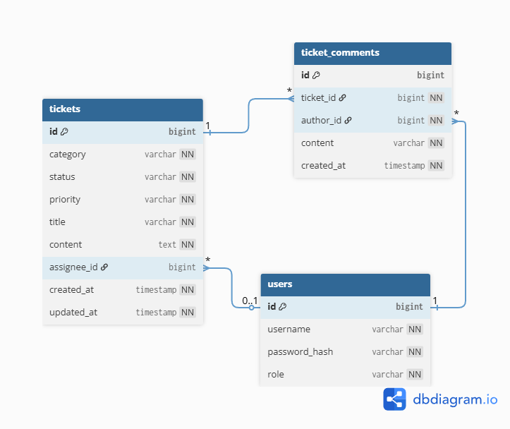

# Helpdesk Backend API

헬프데스크(문의 관리) 백엔드 REST API 프로젝트입니다.  
관리자/사용자 권한 분리, JWT 인증, 티켓 상태 관리 기능을 포함합니다.

---

## 🛠 Tech Stack
- Java 17
- Spring Boot 3.x
- Spring Security + JWT
- JPA (Hibernate)
- MySQL
- Swagger (springdoc-openapi)

---

## 📌 Core Features

### 사용자 / 인증
- JWT 기반 로그인
- USER / ADMIN 권한 분리
- BCrypt 비밀번호 암호화

### 티켓 관리
- 티켓 생성 / 조회 / 수정
- 상태 변경 (OPEN → IN_PROGRESS → RESOLVED)
- 관리자 담당자 지정

### 관리자 기능
- 티켓 검색 / 필터링
- 티켓 댓글(관리자 답변)

---

## 🔐 Authorization Policy

| API | USER | ADMIN |
|---|---|---|
| 티켓 생성 | ✅ | ✅ |
| 티켓 조회 | ✅ | ✅ |
| 티켓 검색 | ❌ | ✅ |
| 상태 변경 | ❌ | ✅ |
| 담당자 지정 | ❌ | ✅ |
| 댓글 작성 | ❌ | ✅ |

---

## ERD



## ▶️ How to Run

```bash
./gradlew bootRun

Swagger: http://localhost:8080/swagger-ui/index.html

테스트 계정
admin / admin1234
user / user1234